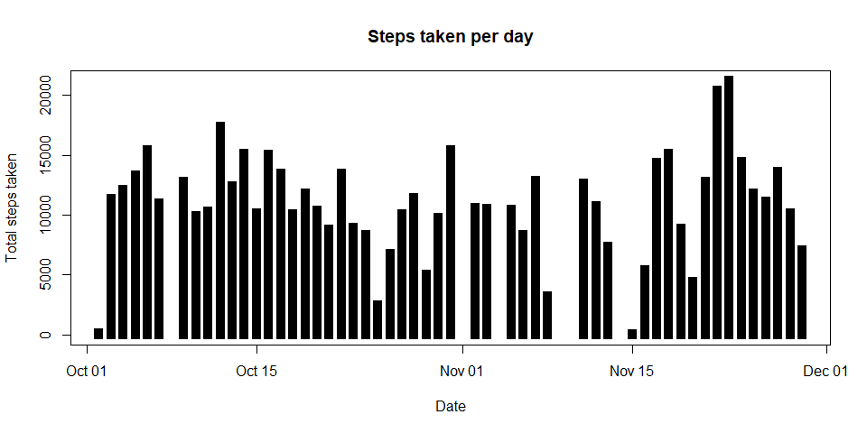
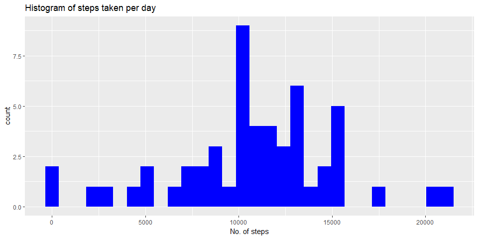
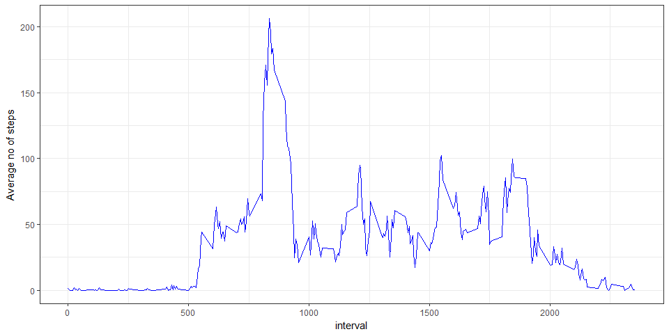
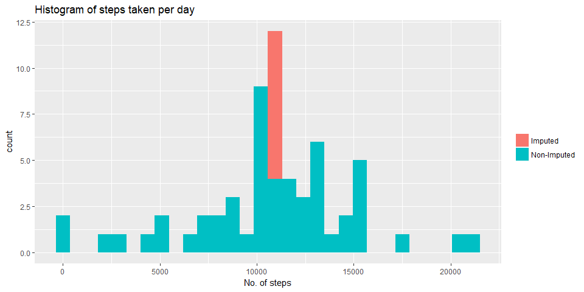
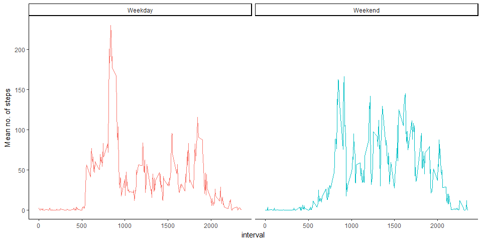

# Reproducible Research: Peer Assessment 1


## Loading and preprocessing the data

The data is saved as a csv file of the name 'activity.csv' inside the folder activity. Reading the data using read.csv()


```r
## Reading the data
activity <- read.csv("./activity/activity.csv",as.is = TRUE,na.strings = "NA")
str(activity)
```

```
## 'data.frame':	17568 obs. of  3 variables:
##  $ steps   : int  NA NA NA NA NA NA NA NA NA NA ...
##  $ date    : chr  "2012-10-01" "2012-10-01" "2012-10-01" "2012-10-01" ...
##  $ interval: int  0 5 10 15 20 25 30 35 40 45 ...
```

From the output of `str()` function, it can be seen that the data frame has 17568 observations and 3 variables, namely `steps`,`date` and `interval`. One thing to notice here is that `date` column is of `character` type and not read as `Date` Class. Changing the format of `date` column to `Date` data type.


```r
## Processing the date column
activity$date <- as.Date(activity$date,format = "%Y-%m-%d")
```

## What is mean total number of steps taken per day?

To find the mean of total number of steps taken per day, first the total number of steps taken each day is calculated.


```r
library(dplyr)
library(knitr)
library(kableExtra)
steps.per.day <- activity %>% group_by(date) %>% summarise(Total.steps = sum(steps))
steps.per.day <- na.omit(steps.per.day)
kable(steps.per.day, "html") %>%
  kable_styling() %>%
        add_footnote("NAs are omitted", notation = "symbol") %>%
                scroll_box(width = "900px", height = "200px") 
```

<div style="border: 1px solid #ddd; padding: 5px; overflow-y: scroll; height:200px; overflow-x: scroll; width:900px; "><table class="table" style="margin-left: auto; margin-right: auto;">
<thead><tr>
<th style="text-align:left;"> date </th>
   <th style="text-align:right;"> Total.steps </th>
  </tr></thead>
<tbody>
<tr>
<td style="text-align:left;"> 2012-10-02 </td>
   <td style="text-align:right;"> 126 </td>
  </tr>
<tr>
<td style="text-align:left;"> 2012-10-03 </td>
   <td style="text-align:right;"> 11352 </td>
  </tr>
<tr>
<td style="text-align:left;"> 2012-10-04 </td>
   <td style="text-align:right;"> 12116 </td>
  </tr>
<tr>
<td style="text-align:left;"> 2012-10-05 </td>
   <td style="text-align:right;"> 13294 </td>
  </tr>
<tr>
<td style="text-align:left;"> 2012-10-06 </td>
   <td style="text-align:right;"> 15420 </td>
  </tr>
<tr>
<td style="text-align:left;"> 2012-10-07 </td>
   <td style="text-align:right;"> 11015 </td>
  </tr>
<tr>
<td style="text-align:left;"> 2012-10-09 </td>
   <td style="text-align:right;"> 12811 </td>
  </tr>
<tr>
<td style="text-align:left;"> 2012-10-10 </td>
   <td style="text-align:right;"> 9900 </td>
  </tr>
<tr>
<td style="text-align:left;"> 2012-10-11 </td>
   <td style="text-align:right;"> 10304 </td>
  </tr>
<tr>
<td style="text-align:left;"> 2012-10-12 </td>
   <td style="text-align:right;"> 17382 </td>
  </tr>
<tr>
<td style="text-align:left;"> 2012-10-13 </td>
   <td style="text-align:right;"> 12426 </td>
  </tr>
<tr>
<td style="text-align:left;"> 2012-10-14 </td>
   <td style="text-align:right;"> 15098 </td>
  </tr>
<tr>
<td style="text-align:left;"> 2012-10-15 </td>
   <td style="text-align:right;"> 10139 </td>
  </tr>
<tr>
<td style="text-align:left;"> 2012-10-16 </td>
   <td style="text-align:right;"> 15084 </td>
  </tr>
<tr>
<td style="text-align:left;"> 2012-10-17 </td>
   <td style="text-align:right;"> 13452 </td>
  </tr>
<tr>
<td style="text-align:left;"> 2012-10-18 </td>
   <td style="text-align:right;"> 10056 </td>
  </tr>
<tr>
<td style="text-align:left;"> 2012-10-19 </td>
   <td style="text-align:right;"> 11829 </td>
  </tr>
<tr>
<td style="text-align:left;"> 2012-10-20 </td>
   <td style="text-align:right;"> 10395 </td>
  </tr>
<tr>
<td style="text-align:left;"> 2012-10-21 </td>
   <td style="text-align:right;"> 8821 </td>
  </tr>
<tr>
<td style="text-align:left;"> 2012-10-22 </td>
   <td style="text-align:right;"> 13460 </td>
  </tr>
<tr>
<td style="text-align:left;"> 2012-10-23 </td>
   <td style="text-align:right;"> 8918 </td>
  </tr>
<tr>
<td style="text-align:left;"> 2012-10-24 </td>
   <td style="text-align:right;"> 8355 </td>
  </tr>
<tr>
<td style="text-align:left;"> 2012-10-25 </td>
   <td style="text-align:right;"> 2492 </td>
  </tr>
<tr>
<td style="text-align:left;"> 2012-10-26 </td>
   <td style="text-align:right;"> 6778 </td>
  </tr>
<tr>
<td style="text-align:left;"> 2012-10-27 </td>
   <td style="text-align:right;"> 10119 </td>
  </tr>
<tr>
<td style="text-align:left;"> 2012-10-28 </td>
   <td style="text-align:right;"> 11458 </td>
  </tr>
<tr>
<td style="text-align:left;"> 2012-10-29 </td>
   <td style="text-align:right;"> 5018 </td>
  </tr>
<tr>
<td style="text-align:left;"> 2012-10-30 </td>
   <td style="text-align:right;"> 9819 </td>
  </tr>
<tr>
<td style="text-align:left;"> 2012-10-31 </td>
   <td style="text-align:right;"> 15414 </td>
  </tr>
<tr>
<td style="text-align:left;"> 2012-11-02 </td>
   <td style="text-align:right;"> 10600 </td>
  </tr>
<tr>
<td style="text-align:left;"> 2012-11-03 </td>
   <td style="text-align:right;"> 10571 </td>
  </tr>
<tr>
<td style="text-align:left;"> 2012-11-05 </td>
   <td style="text-align:right;"> 10439 </td>
  </tr>
<tr>
<td style="text-align:left;"> 2012-11-06 </td>
   <td style="text-align:right;"> 8334 </td>
  </tr>
<tr>
<td style="text-align:left;"> 2012-11-07 </td>
   <td style="text-align:right;"> 12883 </td>
  </tr>
<tr>
<td style="text-align:left;"> 2012-11-08 </td>
   <td style="text-align:right;"> 3219 </td>
  </tr>
<tr>
<td style="text-align:left;"> 2012-11-11 </td>
   <td style="text-align:right;"> 12608 </td>
  </tr>
<tr>
<td style="text-align:left;"> 2012-11-12 </td>
   <td style="text-align:right;"> 10765 </td>
  </tr>
<tr>
<td style="text-align:left;"> 2012-11-13 </td>
   <td style="text-align:right;"> 7336 </td>
  </tr>
<tr>
<td style="text-align:left;"> 2012-11-15 </td>
   <td style="text-align:right;"> 41 </td>
  </tr>
<tr>
<td style="text-align:left;"> 2012-11-16 </td>
   <td style="text-align:right;"> 5441 </td>
  </tr>
<tr>
<td style="text-align:left;"> 2012-11-17 </td>
   <td style="text-align:right;"> 14339 </td>
  </tr>
<tr>
<td style="text-align:left;"> 2012-11-18 </td>
   <td style="text-align:right;"> 15110 </td>
  </tr>
<tr>
<td style="text-align:left;"> 2012-11-19 </td>
   <td style="text-align:right;"> 8841 </td>
  </tr>
<tr>
<td style="text-align:left;"> 2012-11-20 </td>
   <td style="text-align:right;"> 4472 </td>
  </tr>
<tr>
<td style="text-align:left;"> 2012-11-21 </td>
   <td style="text-align:right;"> 12787 </td>
  </tr>
<tr>
<td style="text-align:left;"> 2012-11-22 </td>
   <td style="text-align:right;"> 20427 </td>
  </tr>
<tr>
<td style="text-align:left;"> 2012-11-23 </td>
   <td style="text-align:right;"> 21194 </td>
  </tr>
<tr>
<td style="text-align:left;"> 2012-11-24 </td>
   <td style="text-align:right;"> 14478 </td>
  </tr>
<tr>
<td style="text-align:left;"> 2012-11-25 </td>
   <td style="text-align:right;"> 11834 </td>
  </tr>
<tr>
<td style="text-align:left;"> 2012-11-26 </td>
   <td style="text-align:right;"> 11162 </td>
  </tr>
<tr>
<td style="text-align:left;"> 2012-11-27 </td>
   <td style="text-align:right;"> 13646 </td>
  </tr>
<tr>
<td style="text-align:left;"> 2012-11-28 </td>
   <td style="text-align:right;"> 10183 </td>
  </tr>
<tr>
<td style="text-align:left;"> 2012-11-29 </td>
   <td style="text-align:right;"> 7047 </td>
  </tr>
</tbody>
<tfoot>
<tr>
<td style = 'padding: 0; border:0;' colspan='100%'><sup>*</sup> NAs are omitted</td>
</tr>
</tfoot>
</table></div>

 
Above data can be graphically seen as


```r
plot(steps.per.day, 
     type = "h", 
     lwd = 10, 
     lend = "square", 
     xlab = "Date", 
     ylab = "Total steps taken",
     main = "Steps taken per day")
```

<!-- -->


Let's look at the distribution of total number of steps by plotting a histogram


```r
library(ggplot2)
steps.per.day.hist <- ggplot(steps.per.day,aes(steps.per.day$Total.steps))+geom_histogram(fill = "blue")
steps.per.day.hist + labs(title  = "Histogram of steps taken per day", x = "No. of steps")
```

<!-- -->

It can be seen that the most of the total number of steps are distributed between 10000 and 15000 steps


```r
mean.steps.per.day <- mean(steps.per.day$Total.steps)
median.steps.per.day <- median(steps.per.day$Total.steps)
mean.steps.per.day
```

```
## [1] 10766.19
```

```r
median.steps.per.day
```

```
## [1] 10765
```

Thus we get the following results:  
**Mean** of total number of steps per day is 1.0766189\times 10^{4}  
**Median** of total number of steps per day is 10765

## What is the average daily activity pattern?

To get the average daily activity we should look at steps taken on each 5-minute intervals averaged over all days.   


```r
# Make a time series plot (i.e. type = "l") of the 5-minute interval (x-axis) and the average number of steps taken, averaged across all days (y-axis)
steps_by_interval <- activity %>% group_by(interval) %>% summarise( Mean.steps = mean(steps,na.rm = TRUE))
time.series.plot <- ggplot(steps_by_interval,aes(interval, Mean.steps)) + geom_line(col = "blue")
time.series.plot + theme_bw() + labs(y = "Average no of steps")
```

<!-- -->

The above plot shows the daily acitivity pattern.  
Let's find out which specific interval has the maximum number of steps (averaged) among all the intervals.  

```r
max.index <- which.max(steps_by_interval$Mean.steps)
max.no.steps <- steps_by_interval[max.index,1]
max.no.steps
```

```
## # A tibble: 1 x 1
##   interval
##      <int>
## 1      835
```

The maximum averaged number of steps among all intervals is **206.1698113** and it occurs at the **835th** interval

## Imputing missing values

Till now `NA` values were being omitted. Before adressing `NA` values, Let's look at the number of `NA` values in the data set.


```r
sum(is.na(activity))
```

```
## [1] 2304
```


There are 2304 `NA` values in the data set. Where do we have these `NA` values?


```r
missing <- subset(activity,is.na(activity$steps))
table(missing$date)
```

```
## 
## 2012-10-01 2012-10-08 2012-11-01 2012-11-04 2012-11-09 2012-11-10 
##        288        288        288        288        288        288 
## 2012-11-14 2012-11-30 
##        288        288
```

Since we know that the no of intervals for each day is 288, from the above table we can infer that entire day's data is missing for the above given dates.  

There are different ways by which `NA` values can be imputed. Here imputation is done using average number of steps for each interval.


```r
# Adding a column named Missing that represents whether the data is imputed or not.
activity$Missing <- as.factor(ifelse(is.na(activity$steps),"Imputed","Non-Imputed"))


activity_imputed <- transform(activity,
                              steps = ifelse(is.na(activity$steps),
                                             steps_by_interval$Mean.steps[match(activity$interval,
                                                                                steps_by_interval$interval)],
                                             activity$steps))
```


Let's look at the distribution of total number of per day by plotting a histogram.  


```r
steps.per.day.imputed <- activity_imputed %>% group_by(date,Missing) %>% summarise(Total.steps = sum(steps))
steps.per.day.imputed.hist <- ggplot(steps.per.day.imputed,aes(Total.steps))+geom_histogram(aes(fill = Missing))
steps.per.day.imputed.hist + labs(title  = "Histogram of steps taken per day", x = "No. of steps",fill ="")
```

<!-- -->

Let's look at the mean and median of total number of steps taken per day

```r
mean.steps.per.day.imputed <- mean(steps.per.day.imputed$Total.steps)
median.steps.per.day.imputed <- median(steps.per.day.imputed$Total.steps)
mean.steps.per.day.imputed
```

```
## [1] 10766.19
```

```r
median.steps.per.day.imputed
```

```
## [1] 10766.19
```

Thus we get the following results:  
**Mean** of total number of steps per day after imputing is **1.0766189\times 10^{4}** (Recall that **mean before imputing** was **1.0766189\times 10^{4}**)  
**Median** of total number of steps per day after imputing is **1.0766189\times 10^{4}** (Recall that **median before imputing** was **10765**)  
Difference in the total number of steps is **8.6129509\times 10^{4}**  

## Are there differences in activity patterns between weekdays and weekends?

To find the differences in activity patterns between weekdays and weekends, a new variable `Day` representing the day of the week for the corresponding date is created.  

```r
weekend <- c("Sunday","Saturday")
activity_imputed$Day <- as.factor(ifelse(weekdays(activity_imputed$date) %in% weekend, "Weekend","Weekday"))
```

To get the average daily activity we should look at steps taken on each 5-minute intervals averaged over all days.  


```r
time.series.by.day <- activity_imputed %>% group_by(interval,Day) %>% summarise(mean.steps = mean(steps))
time.series.by.day.plot <- ggplot(time.series.by.day,aes(interval,mean.steps)) + geom_line(aes(col = Day),lwd = 0.7,show.legend = FALSE)
time.series.by.day.plot + theme_classic() + facet_grid(.~Day) + labs(y = "Mean no. of steps")
```

<!-- -->

The above plot shows the time series plot of average daily activity separated between weekends and weekdays.  
It is clear from the plot that during weekdays there a big peak in number of steps around 800 to 900 hours in the morning.This is expected as most people go to work around that time. That is also the case in weekends but the amplitude of the spike is less than that of weekdays. But during weekends there are spikes even after 900 hours whereas in weekdays there seems to be none (significantly). There is smaller yet significant peak of number of steps during weekday around 1800 to 1900 hours, which corresponds to the return home from work. This is missing from that of weekends.
